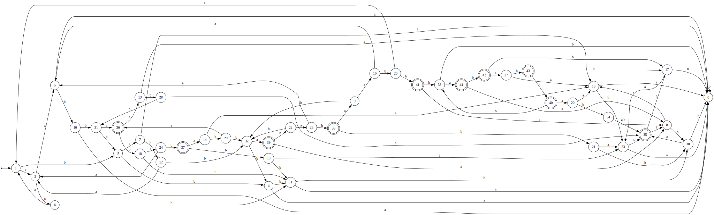

# Lab 2 (Скороходов Иван ИУ9-51Б, вариант 24)

Исходная академическая регулярка:
$(aba|bab|aabb)\*(a|b)(a|b)bba(aba|bab|aabb)\*$

### ДКА (минимальный)

Описание в DOT:

```
digraph DFA {
rankdir=LR;
    node [shape=circle];

    // Старт
    start [shape=point];
    start -> 1;

    // Принимающие
    node [shape=doublecircle];
    35 36 37 38 39 40 41 42 43 44;

    node [shape=circle];

    0  -> 0  [label="a,b"];
    1  -> 2  [label="a"];
    1  -> 3  [label="b"];
    2  -> 5  [label="a"];
    2  -> 6  [label="b"];
    3  -> 7  [label="a"];
    3  -> 4  [label="b"];
    4  -> 0  [label="a"];
    4  -> 11 [label="b"];
    5  -> 0  [label="a"];
    5  -> 10 [label="b"];
    6  -> 1  [label="a"];
    6  -> 11 [label="b"];
    7  -> 0  [label="a"];
    7  -> 12 [label="b"];
    8  -> 15 [label="a"];
    8  -> 30 [label="b"];
    9  -> 16 [label="a"];
    9  -> 32 [label="b"];
    10 -> 0  [label="a"];
    10 -> 31 [label="b"];
    11 -> 0  [label="a"];
    11 -> 30 [label="b"];
    12 -> 2  [label="a"];
    12 -> 32 [label="b"];
    13 -> 15 [label="a"];
    13 -> 28 [label="b"];
    14 -> 15 [label="a"];
    14 -> 29 [label="b"];
    15 -> 0  [label="a"];
    15 -> 23 [label="b"];
    16 -> 5  [label="a"];
    16 -> 26 [label="b"];
    17 -> 23 [label="a"];
    17 -> 0  [label="b"];
    18 -> 24 [label="a"];
    18 -> 11 [label="b"];
    19 -> 23 [label="a"];
    19 -> 11 [label="b"];
    20 -> 15 [label="a"];
    20 -> 34 [label="b"];
    21 -> 23 [label="a"];
    21 -> 30 [label="b"];
    22 -> 25 [label="a"];
    22 -> 32 [label="b"];
    23 -> 0  [label="a"];
    23 -> 35 [label="b"];
    24 -> 2  [label="a"];
    24 -> 37 [label="b"];
    25 -> 5  [label="a"];
    25 -> 38 [label="b"];
    26 -> 1  [label="a"];
    26 -> 41 [label="b"];
    27 -> 15 [label="a"];
    27 -> 43 [label="b"];
    28 -> 35 [label="a"];
    28 -> 31 [label="b"];
    29 -> 36 [label="a"];
    29 -> 32 [label="b"];
    30 -> 35 [label="a"];
    30 -> 0  [label="b"];
    31 -> 36 [label="a"];
    31 -> 3  [label="b"];
    32 -> 39 [label="a"];
    32 -> 4  [label="b"];
    33 -> 44 [label="a"];
    33 -> 0  [label="b"];
    34 -> 35 [label="a,b"];
    35 -> 8  [label="a"];
    35 -> 17 [label="b"];
    36 -> 13 [label="a"];
    36 -> 18 [label="b"];
    37 -> 14 [label="a"];
    37 -> 19 [label="b"];
    38 -> 9  [label="a"];
    38 -> 21 [label="b"];
    39 -> 8  [label="a"];
    39 -> 22 [label="b"];
    40 -> 20 [label="a"];
    40 -> 33 [label="b"];
    41 -> 8  [label="a"];
    41 -> 33 [label="b"];
    42 -> 27 [label="a"];
    42 -> 17 [label="b"];
    43 -> 40 [label="a"];
    43 -> 17 [label="b"];
    44 -> 8  [label="a"];
    44 -> 42 [label="b"];
}
```

Собственно говоря, вот как он выглядит:


И таблица для него (на всякий случай будет продублированнна в tableDFA.txt):
| State | a | b | bb | bba | abba | aabba | bbba | abaabba | bbbba | ab | ba | aba | aab | abb | bab | babb | bbab | abbaabb | aabbabb | baabba | bbaa | abbba | aabbba | baaabb | bbbbbba |
|-------|---|---|----|-----|-------|--------|-------|-----------|--------|-----|-----|------|------|------|------|-------|-------|-----------|-----------|---------|-------|--------|---------|---------|----------|
| 0 | 0 | 0 | 0 | 0 | 0 | 0 | 0 | 0 | 0 | 0 | 0 | 0 | 0 | 0 | 0 | 0 | 0 | 0 | 0 | 0 | 0 | 0 | 0 | 0 | 0 |
| 1 | 0 | 0 | 0 | 0 | 0 | 1 | 0 | 0 | 1 | 0 | 0 | 0 | 0 | 0 | 0 | 0 | 0 | 0 | 0 | 0 | 0 | 1 | 0 | 0 | 0 |
| 2 | 0 | 0 | 0 | 0 | 1 | 0 | 1 | 0 | 0 | 0 | 0 | 0 | 0 | 0 | 0 | 0 | 0 | 0 | 0 | 0 | 0 | 0 | 0 | 0 | 0 |
| 3 | 0 | 0 | 0 | 0 | 1 | 0 | 1 | 1 | 0 | 0 | 0 | 0 | 0 | 0 | 0 | 0 | 0 | 0 | 0 | 0 | 0 | 0 | 0 | 0 | 0 |
| 4 | 0 | 0 | 0 | 1 | 0 | 0 | 0 | 0 | 0 | 0 | 0 | 0 | 0 | 0 | 0 | 0 | 0 | 0 | 0 | 0 | 0 | 0 | 0 | 0 | 0 |
| 5 | 0 | 0 | 0 | 1 | 0 | 0 | 0 | 0 | 0 | 0 | 0 | 0 | 0 | 0 | 0 | 0 | 0 | 0 | 0 | 0 | 0 | 0 | 0 | 0 | 1 |
| 6 | 0 | 0 | 0 | 1 | 0 | 0 | 0 | 0 | 0 | 0 | 0 | 0 | 0 | 0 | 0 | 0 | 0 | 0 | 0 | 0 | 0 | 0 | 1 | 0 | 0 |
| 7 | 0 | 0 | 0 | 1 | 0 | 0 | 0 | 0 | 0 | 0 | 0 | 0 | 0 | 0 | 0 | 0 | 0 | 0 | 0 | 1 | 0 | 0 | 0 | 0 | 0 |
| 8 | 0 | 0 | 0 | 0 | 0 | 0 | 0 | 0 | 0 | 0 | 1 | 0 | 0 | 1 | 0 | 0 | 0 | 1 | 0 | 0 | 0 | 0 | 0 | 1 | 0 |
| 9 | 0 | 0 | 0 | 0 | 0 | 1 | 0 | 0 | 1 | 0 | 1 | 0 | 0 | 1 | 0 | 0 | 0 | 1 | 0 | 0 | 0 | 1 | 0 | 1 | 0 |
| 10 | 0 | 0 | 0 | 0 | 0 | 0 | 0 | 0 | 0 | 0 | 1 | 0 | 0 | 0 | 0 | 0 | 0 | 0 | 0 | 1 | 0 | 0 | 0 | 1 | 0 |
| 11 | 0 | 0 | 0 | 0 | 0 | 0 | 0 | 0 | 0 | 0 | 1 | 0 | 0 | 0 | 0 | 0 | 0 | 0 | 0 | 0 | 0 | 0 | 0 | 1 | 0 |
| 12 | 0 | 0 | 0 | 0 | 0 | 1 | 0 | 0 | 1 | 0 | 1 | 0 | 0 | 0 | 0 | 0 | 0 | 0 | 0 | 0 | 0 | 1 | 0 | 1 | 0 |
| 13 | 0 | 0 | 0 | 1 | 0 | 0 | 0 | 0 | 0 | 0 | 1 | 0 | 0 | 1 | 0 | 0 | 0 | 1 | 0 | 0 | 0 | 0 | 0 | 1 | 1 |
| 14 | 0 | 0 | 0 | 1 | 0 | 0 | 0 | 0 | 0 | 0 | 1 | 0 | 0 | 1 | 0 | 0 | 0 | 1 | 0 | 1 | 0 | 0 | 0 | 1 | 0 |
| 15 | 0 | 0 | 1 | 0 | 0 | 0 | 0 | 0 | 0 | 0 | 0 | 0 | 0 | 0 | 0 | 0 | 0 | 0 | 0 | 0 | 0 | 0 | 0 | 0 | 0 |
| 16 | 0 | 0 | 1 | 0 | 1 | 0 | 1 | 0 | 0 | 0 | 0 | 0 | 0 | 0 | 0 | 0 | 0 | 0 | 0 | 0 | 0 | 0 | 0 | 0 | 0 |
| 17 | 0 | 0 | 0 | 0 | 0 | 0 | 0 | 0 | 0 | 1 | 0 | 0 | 0 | 0 | 0 | 0 | 0 | 0 | 0 | 0 | 0 | 0 | 0 | 0 | 0 |
| 18 | 0 | 0 | 0 | 1 | 0 | 0 | 0 | 0 | 0 | 1 | 0 | 0 | 0 | 0 | 0 | 0 | 0 | 0 | 0 | 0 | 0 | 0 | 1 | 0 | 0 |
| 19 | 0 | 0 | 0 | 1 | 0 | 0 | 0 | 0 | 0 | 1 | 0 | 0 | 0 | 0 | 0 | 0 | 0 | 0 | 0 | 0 | 0 | 0 | 0 | 0 | 0 |
| 20 | 0 | 0 | 1 | 0 | 0 | 0 | 0 | 0 | 0 | 0 | 1 | 0 | 0 | 1 | 0 | 0 | 0 | 1 | 0 | 0 | 0 | 0 | 0 | 1 | 0 |
| 21 | 0 | 0 | 0 | 0 | 0 | 0 | 0 | 0 | 0 | 1 | 1 | 0 | 0 | 0 | 0 | 0 | 0 | 0 | 0 | 0 | 0 | 0 | 0 | 1 | 0 |
| 22 | 0 | 0 | 0 | 0 | 0 | 1 | 0 | 0 | 1 | 1 | 1 | 0 | 0 | 0 | 0 | 0 | 0 | 0 | 0 | 0 | 0 | 1 | 0 | 1 | 0 |
| 23 | 0 | 1 | 0 | 0 | 0 | 0 | 0 | 0 | 0 | 0 | 0 | 0 | 0 | 0 | 0 | 0 | 1 | 0 | 0 | 0 | 0 | 0 | 0 | 0 | 0 |
| 24 | 0 | 1 | 0 | 0 | 0 | 1 | 0 | 0 | 1 | 0 | 0 | 0 | 0 | 0 | 0 | 0 | 1 | 0 | 0 | 0 | 0 | 1 | 0 | 0 | 0 |
| 25 | 0 | 1 | 0 | 0 | 1 | 0 | 1 | 0 | 0 | 0 | 0 | 0 | 0 | 0 | 0 | 0 | 1 | 0 | 0 | 0 | 0 | 0 | 0 | 0 | 0 |
| 26 | 0 | 1 | 0 | 1 | 0 | 0 | 0 | 0 | 0 | 0 | 0 | 0 | 0 | 0 | 0 | 0 | 1 | 0 | 0 | 0 | 0 | 0 | 1 | 0 | 0 |
| 27 | 0 | 1 | 0 | 0 | 0 | 0 | 0 | 0 | 0 | 0 | 1 | 0 | 0 | 1 | 0 | 0 | 1 | 1 | 0 | 0 | 0 | 0 | 0 | 1 | 0 |
| 28 | 1 | 0 | 0 | 0 | 0 | 0 | 0 | 0 | 0 | 0 | 1 | 0 | 0 | 0 | 0 | 0 | 0 | 0 | 0 | 1 | 0 | 0 | 0 | 1 | 0 |
| 29 | 1 | 0 | 0 | 0 | 0 | 1 | 0 | 0 | 1 | 0 | 1 | 0 | 0 | 0 | 0 | 0 | 0 | 0 | 0 | 0 | 0 | 1 | 0 | 1 | 0 |
| 30 | 1 | 0 | 0 | 0 | 0 | 0 | 0 | 0 | 0 | 0 | 0 | 0 | 0 | 0 | 0 | 0 | 0 | 0 | 0 | 0 | 0 | 0 | 0 | 0 | 0 |
| 31 | 1 | 0 | 0 | 0 | 0 | 1 | 0 | 0 | 1 | 0 | 0 | 0 | 0 | 0 | 0 | 0 | 0 | 0 | 0 | 0 | 0 | 1 | 0 | 0 | 0 |
| 32 | 1 | 0 | 0 | 0 | 1 | 0 | 1 | 1 | 0 | 0 | 0 | 0 | 0 | 0 | 0 | 0 | 0 | 0 | 0 | 0 | 0 | 0 | 0 | 0 | 0 |
| 33 | 1 | 0 | 0 | 0 | 0 | 0 | 0 | 0 | 0 | 1 | 0 | 0 | 0 | 0 | 0 | 0 | 0 | 0 | 0 | 0 | 0 | 0 | 0 | 0 | 0 |
| 34 | 1 | 1 | 0 | 0 | 0 | 0 | 0 | 0 | 0 | 0 | 0 | 0 | 0 | 0 | 0 | 0 | 1 | 0 | 0 | 0 | 0 | 0 | 0 | 0 | 0 |
| 35 | 0 | 0 | 0 | 0 | 0 | 0 | 0 | 0 | 0 | 0 | 0 | 1 | 0 | 0 | 1 | 0 | 0 | 0 | 0 | 0 | 0 | 0 | 0 | 0 | 0 |
| 36 | 0 | 0 | 0 | 0 | 1 | 0 | 1 | 0 | 0 | 0 | 0 | 1 | 0 | 0 | 1 | 0 | 0 | 0 | 0 | 0 | 0 | 0 | 0 | 0 | 0 |
| 37 | 0 | 0 | 0 | 0 | 1 | 0 | 1 | 1 | 0 | 0 | 0 | 1 | 0 | 0 | 1 | 0 | 0 | 0 | 0 | 0 | 0 | 0 | 0 | 0 | 0 |
| 38 | 0 | 0 | 0 | 1 | 0 | 0 | 0 | 0 | 0 | 0 | 0 | 1 | 0 | 0 | 1 | 0 | 0 | 0 | 0 | 0 | 0 | 0 | 1 | 0 | 0 |
| 39 | 0 | 0 | 0 | 1 | 0 | 0 | 0 | 0 | 0 | 0 | 0 | 1 | 0 | 0 | 1 | 0 | 0 | 0 | 0 | 1 | 0 | 0 | 0 | 0 | 0 |
| 40 | 0 | 0 | 0 | 0 | 0 | 0 | 0 | 0 | 0 | 0 | 1 | 1 | 0 | 1 | 1 | 0 | 0 | 1 | 0 | 0 | 0 | 0 | 0 | 1 | 0 |
| 41 | 0 | 0 | 0 | 0 | 0 | 0 | 0 | 0 | 0 | 0 | 1 | 1 | 0 | 0 | 1 | 0 | 0 | 0 | 0 | 0 | 0 | 0 | 0 | 1 | 0 |
| 42 | 0 | 0 | 0 | 0 | 0 | 0 | 0 | 0 | 0 | 1 | 0 | 1 | 0 | 0 | 1 | 0 | 0 | 0 | 0 | 0 | 0 | 0 | 0 | 0 | 0 |
| 43 | 1 | 0 | 0 | 0 | 0 | 0 | 0 | 0 | 0 | 0 | 0 | 1 | 0 | 0 | 1 | 0 | 0 | 0 | 0 | 0 | 0 | 0 | 0 | 0 | 0 |
| 44 | 0 | 1 | 0 | 0 | 0 | 0 | 0 | 0 | 0 | 0 | 0 | 1 | 0 | 0 | 1 | 0 | 1 | 0 | 0 | 0 | 0 | 0 | 0 | 0 | 0 |

### НКА (возможно малый)
Вот его описание в DOT:
```
digraph NFA {
    rankdir=LR;

    node [shape=circle];

    // Старт
    start [shape=point];
    start -> 1;

    // Принимающее состояние
    node [shape=doublecircle];
    8;

    node [shape=circle];
    
    0 -> 0 [label="a,b"];
    1 -> 2 [label="a"];
    1 -> 9 [label="b"];
    2 -> 3 [label="a"];
    2 -> 6 [label="b"];
    3 -> 0 [label="a"];
    3 -> 4 [label="b"];
    4 -> 0 [label="a"];
    4 -> 5 [label="b"];
    4 -> 1 [label="b"];
    5 -> 8 [label="a"];
    5 -> 0 [label="b"];
    6 -> 1 [label="a"];
    6 -> 7 [label="b"];
    7 -> 0 [label="a"];
    7 -> 5 [label="b"];
    9  -> 10 [label="a"];
    9  -> 11 [label="b"];
    10 -> 0 [label="a"];
    10 -> 7 [label="b"];
    10 -> 1 [label="b"];
    11 -> 0 [label="a"];
    11 -> 7 [label="b"];
    8  -> 12 [label="a"];
    8  -> 16 [label="b"];
    12 -> 13 [label="a"];
    12 -> 15 [label="b"];
    13 -> 0  [label="a"];
    13 -> 14 [label="b"];
    14 -> 0  [label="a"];
    14 -> 8  [label="b"];
    15 -> 8  [label="a"];
    15 -> 0  [label="b"];
    16 -> 17 [label="a"];
    16 -> 0  [label="b"];
    17 -> 0  [label="a"];
    17 -> 8  [label="b"];
}
```

Вот как он выглядит:

