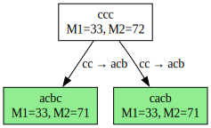

# Lab 1 (Скороходов Иван ИУ9-51Б)

Исходная SRS (24 вариант):

1. $\texttt{aa} \to \texttt{E}$
2. $\texttt{bb} \to \texttt{cccc}$
3. $\texttt{cc} \to \texttt{acb}$
4. $\texttt{abc} \to \texttt{aabbcc}$
5. $\texttt{baabaac} \to \texttt{cbba}$

## Завершимость (есть)

Система завершима, рассмотрим вектор V = (n1, n2, ..., nk), где

- каждое ni соответствует максимальному относительно ni блоку anib
- рассматриваем b последовательно слева направо
- если нет b в строке, то вектор пустой

#### Идея: если строка находится в НФ, то V будет либо пустым (если нет b в строке), либо будет состоять только из 0 и 1, так как возможны только случаи cb (0) и ab (1), aab уже не может быть, так как строка тогда не будет находиться в НФ.

Посмотрим на изменения вектора V при применении правил переписывания:

1. $\texttt{aa} \to \texttt{E}$

Если $aa$ находилось в каком-либо блоке, то тогда мы уменьшаем соответствующую координату в V на 2.
Иначе - длина строки уменьшается, и мы не можем применять это правило бесконечно раз само по себе.
А также при его применении мы не попадаем в правило, где снова порождаем $aa$ и до редуцирования $aa$ не могли его применить.

2. $\texttt{bb} \to \texttt{cccc}$

Здесь мы лишаемся двух координат в V.

3. $\texttt{cc} \to \texttt{acb}$.

Мы получаем лишнюю координату в V. Но оценим её значение:

- Дальше не переписывается => 0.
- Дальше переписывается через 5 правило ($\texttt{baabacc} \to \texttt{baabaacb} \to \texttt{cbbab}$) и дальше никак не можем увеличить количество $a$ для расссматриваемой $b$ => 1.
- Редуцируем все $a$ и переписываемся через 3 правило ($\texttt{cacc} \to \texttt{caacb} \to \texttt{ccb}$) и дальше никак к рассматриваемой $b$ не добавить слева $a$ => 0.
- Никакая другая LHS правила не заканчивается на $ac$ или $c$.
- Бесконечно применять это правило мы не можем.

То есть в V добавляются 0 или 1, что нас удовлетворяет.

4. $\texttt{abc} \to \texttt{aabbcc}$

На первый взгляд все плохо, но давайте посмотрим сразу на следующий же примененный шаг:

- Мы можем сразу применить правило 2, и тогда по итогу мы начинали с одной $b$, а закончили с нулем => в V пропадёт координата по итогу.
- Редуцируем все $a$ (уже снижая 2 соответствующие координаты до 0 в V) и можем получить $cbbcc$, $bbbcc$ или $bbcc$, и во всех случаях дальше редуцируем $bb$ (никаккое правило не может разнести $bb$, сохранив их в строке) => в V пропадёт координата по итогу.

5. $\texttt{baabaac} \to \texttt{cbba}$

В этом правиле у нас:

- Начальные координаты в V - n (до первой b могло стоять сколько угодно a) и 2.
- После применения (n, 2) меняются на (0, 0).
- И может один 0 увеличиться до 1 в V, так как возможен случай $\texttt{baabaacb} \to \texttt{cbbab}$.
- Бесконечно применять это правило мы не можем.

То есть во всех правилах у нас состояние вектора V стремиться к состоянию, где строка представлется в НФ, или как в случае первого правила уменьшается длина строки.

## Классы эквивалентности (бесконечное количество)

В данной SRS бесконечное число классов эквивалентности.

Рассмотрим строки $(ab)^n$ ($n\ge1$) - каждая из них является НФ.

## Локальная конфлюэнтность (отсутствует)

Зеленым цветом отмечены НФ (на $M1$ и $M2$ можно не обращать внимание).

## Пополняемость по Кнуту-Бендиксу (вроде как пополнилась)

Пополнять будем по армейскому порядку ($a < b < c$).

Для начала переориентируем некторые правила, получив:

1. $\texttt{aa} \to \texttt{E}$
2. $\texttt{cccc} \to \texttt{bb}$
3. $\texttt{acb} \to \texttt{cc}$
4. $\texttt{aabbcc} \to \texttt{abc}$
5. $\texttt{baabaac} \to \texttt{cbba}$

### Начнем пополнять

### Итерация 1

#### Рассмотрим неразрешимую критическую пару слова $aacb$, ($cb$, $acc$ - полученные НФ)

- Добавляем новое правило $acc \to cb$
- Заменяем правило $aabbcc \to abc$ на $bbcc \to abc$
- Заменяем правило $baabaac \to cbba$ на $cbba \to bbc$

#### Рассмотрим неразрешимую критическую пару слова $ccccccc$, ($cccbb$, $bbccc$ - полученные НФ)

- Добавляем новое правило $cccbb \to abcc$

#### Рассмотрим неразрешимую критическую пару слова $cccccc$, ($ccbb$, $bbcc$ - полученные НФ)

- Добавляем новое правило $ccbb \to abc$
- Заменяем правило $cccbb \to abcc$ на $cabc \to abcc$

#### Рассмотрим неразрешимую критическую пару слова $ccccc$, ($cbb$, $bbc$ - полученные НФ)

- Добавляем новое правило $cbb \to bbc$
- Заменяем правило $cbba \to bbc$ на $bbca \to bbc$
- Удаляем правило $ccbb \to abc$

#### Рассмотрим неразрешимую критическую пару слова $aabbccccc$, ($aabbcbb$, $abcccc$ - полученные НФ)

- Добавляем новое правило $bbbbc \to abbb$

#### Рассмотрим неразрешимую критическую пару слова $aabbcccc$, ($aabbbb$, $abccc$ - полученные НФ)

- Добавляем новое правило $abccc \to bbbb$

#### Рассмотрим неразрешимую критическую пару слова $baabaacccc$, ($baabaabb$, $cbbaccc$ - полученные НФ)

- Добавляем новое правило $abcbc \to bbbb$

#### Рассмотрим неразрешимую критическую пару слова $acbaabaac$, ($ccaabaac$, $accbba$ - полученные НФ)

- Добавляем новое правило $bbcba \to ccbc$

### Итерация 2

#### Рассмотрим неразрешимую критическую пару слова $aabcbc$, ($bcbc$, $abbbb$ - полученные НФ)

- Добавляем новое правило $abbbb \to bcbc$

#### Рассмотрим неразрешимую критическую пару слова $aabccc$, ($bccc$, $abbbb$ - полученные НФ)

- Добавляем новое правило $bccc \to bcbc$
- Удаляем правило $abccc \to bbbb$

#### Рассмотрим неразрешимую критическую пару слова $bbcbaa$, ($bbcb$, $ccbca$ - полученные НФ)

- Добавляем новое правило $ccbca \to bbcb$

#### Рассмотрим неразрешимую критическую пару слова $acbb$, ($ccb$, $abbc$ - полученные НФ)

- Добавляем новое правило $abbc \to ccb$

#### Рассмотрим неразрешимую критическую пару слова $bbcacb$, ($bbccc$, $bbccb$ - полученные НФ)

- Добавляем новое правило $abcc \to abcb$
- Заменяем правило $cabc \to abcc$ на $cabc \to abcb$

#### Рассмотрим неразрешимую критическую пару слова $acbbca$, ($ccbca$, $acbbc$ - полученные НФ)

- Добавляем новое правило $ccbc \to bbcb$
- Заменяем правило $bbcba \to ccbc$ на $bbcba \to bbcb$
- Удаляем правило $ccbca \to bbcb$

#### Рассмотрим неразрешимую критическую пару слова $acbbcc$, ($ccbcc$, $acabc$ - полученные НФ)

- Добавляем новое правило $bbcbc \to bcb$

#### Рассмотрим неразрешимую критическую пару слова $acbbbbc$, ($ccbbbc$, $acabbb$ - полученные НФ)

- Добавляем новое правило $acabbb \to bbbb$

#### Рассмотрим неразрешимую критическую пару слова $bbcbacb$, ($bbcbcc$, $ccbccb$ - полученные НФ)

- Добавляем новое правило $bcbc \to bbbc$
- Заменяем правило $bccc \to bcbc$ на $bccc \to bbbc$
- Заменяем правило $abbbb \to bcbc$ на $abbbb \to bbbc$
- Заменяем правило $abcbc \to bbbb$ на $abbbc \to bbbb$
- Заменяем правило $bbcbc \to bcb$ на $abbb \to bcb$

#### Рассмотрим неразрешимую критическую пару слова $accabc$, ($cbabc$, $acabcc$ - полученные НФ)

- Добавляем новое правило $cbabc \to bbbc$
- Удаляем правило $abbbb \to bbbc$
- Заменяем правило $abbbc \to bbbb$ на $bbbc \to bbbb$
- Заменяем правило $bbbbc \to abbb$ на $bbbbc \to bcb$
- Заменяем правило $acabbb \to bbbb$ на $cccb \to bbbb$

#### Рассмотрим неразрешимую критическую пару слова $acccc$, ($cbcc$, $abb$ - полученные НФ)

- Добавляем новое правило $cbcc \to abb$
- Заменяем правило $bcbc \to bbbc$ на $bcbc \to bbbb$
- Заменяем правило $bccc \to bbbc$ на $bccc \to bbbb$
- Заменяем правило $bbbbc \to bcb$ на $bbbbb \to bcb$
- Заменяем правило $cbabc \to bbbc$ на $cbabc \to bbbb$

#### Рассмотрим неразрешимую критическую пару слова $accccc$, ($cbccc$, $acbb$ - полученные НФ)

- Добавляем новое правило $ccb \to bcb$
- Заменяем правило $abbc \to ccb$ на $abbc \to bcb$
- Заменяем правило $ccbc \to bbcb$ на $bbcb \to bbbb$
- Заменяем правило $cccb \to bbbb$ на $cbcb \to bbbb$

#### Рассмотрим неразрешимую критическую пару слова $cbbca$, ($bbcca$, $cbbc$ - полученные НФ)

- Добавляем новое правило $abca \to abc$
- Заменяем правило $bbcba \to bbcb$ на $bbbba \to bbbb$

#### Рассмотрим неразрешимую критическую пару слова $cbbbca$, ($bbcbca$, $cbbbc$ - полученные НФ)

- Добавляем новое правило $bcba \to bcb$

#### Рассмотрим неразрешимую критическую пару слова $bbcabc$, ($bbcbc$, $bbabcc$ - полученные НФ)

- Добавляем новое правило $bbabcb \to bcb$

#### Рассмотрим неразрешимую критическую пару слова $bbbbcc$, ($bbabc$, $abbbc$ - полученные НФ)

- Добавляем новое правило $bbabc \to bbbb$
- Удаляем правило $bbabcb \to bcb$

#### Рассмотрим неразрешимую критическую пару слова $cabcabc$, ($cababcc$, $abccabc$ - полученные НФ)

- Добавляем новое правило $cababcb \to bcb$

### Итерация 3

#### Рассмотрим неразрешимую критическую пару слова $aabbb$, ($bbb$, $abcb$ - полученные НФ)

- Добавляем новое правило $abcb \to bbb$
- Заменяем правило $abcc \to abcb$ на $abcc \to bbb$
- Заменяем правило $cabc \to abcb$ на $cabc \to bbb$
- Удаляем правило $cababcb \to bcb$

#### Рассмотрим неразрешимую критическую пару слова $aabbc$, ($bbc$, $abcb$ - полученные НФ)

- Добавляем новое правило $bbc \to bbb$
- Заменяем правило $cbb \to bbc$ на $cbb \to bbb$
- Удаляем правило $abbc \to bcb$
- Удаляем правило $bbbc \to bbbb$
- Заменяем правило $bbca \to bbc$ на $bbba \to bbb$
- Удаляем правило $bbcb \to bbbb$
- Заменяем правило $bbcc \to abc$ на $bbbb \to abc$

#### Рассмотрим неразрешимую критическую пару слова $aabca$, ($bca$, $aabc$ - полученные НФ)

- Добавляем новое правило $bca \to bc$
- Удаляем правило $abca \to abc$
- Заменяем правило $bcbc \to bbbb$ на $bcbc \to abc$
- Заменяем правило $bccc \to bbbb$ на $bccc \to abc$
- Заменяем правило $cbcb \to bbbb$ на $cbcb \to abc$
- Заменяем правило $bbabc \to bbbb$ на $bbabc \to abc$
- Удаляем правило $bbbba \to bbbb$
- Заменяем правило $bbbbb \to bcb$ на $bcb \to bbb$
- Заменяем правило $cbabc \to bbbb$ на $cbabc \to abc$

#### Рассмотрим неразрешимую критическую пару слова $aabcc$, ($bcc$, $aabcb$ - полученные НФ)

- Добавляем новое правило $bcc \to bbb$
- Заменяем правило $ccb \to bcb$ на $ccb \to bbb$
- Заменяем правило $abbb \to bcb$ на $abbb \to bbb$
- Удаляем правило $abcb \to bbb$
- Удаляем правило $abcc \to bbb$
- Удаляем правило $bcba \to bcb$
- Удаляем правило $bcbc \to abc$
- Удаляем правило $bccc \to abc$
- Удаляем правило $cbcb \to abc$
- Заменяем правило $cbcc \to abb$ на $abc \to abb$

#### Рассмотрим неразрешимую критическую пару слова $accbcc$, ($cbbcc$, $acabb$ - полученные НФ)

- Добавляем новое правило $acabb \to bbb$
- Заменяем правило $bbbb \to abc$ на $bbbb \to abb$
- Заменяем правило $cabc \to bbb$ на $cabb \to bbb$
- Заменяем правило $bbabc \to abc$ на $bbabb \to abb$
- Заменяем правило $cbabc \to abc$ на $cbabb \to abb$

#### Рассмотрим неразрешимую критическую пару слова $abbbcc$, ($bcbcc$, $ababc$ - полученные НФ)

- Добавляем новое правило $ababb \to bbb$
- Удаляем правило $acabb \to bbb$

#### Рассмотрим неразрешимую критическую пару слова $abbcc$, ($bcbc$, $aabc$ - полученные НФ)

- Добавляем новое правило $abb \to bc$
- Заменяем правило $abc \to abb$ на $abc \to bc$
- Удаляем правило $abbb \to bbb$
- Заменяем правило $bbbb \to abb$ на $bbbb \to bc$
- Заменяем правило $cabb \to bbb$ на $cbc \to bbb$
- Удаляем правило $ababb \to bbb$
- Удаляем правило $bbabb \to abb$
- Удаляем правило $cbabb \to abb$

### Итерация 4

#### Рассмотрим неразрешимую критическую пару слова $aabb$, ($bb$, $abc$ - полученные НФ)

- Добавляем новое правило $bc \to bb$
- Заменяем правило $abb \to bc$ на $abb \to bb$
- Удаляем правило $abc \to bc$
- Удаляем правило $bbc \to bbb$
- Заменяем правило $bca \to bc$ на $bba \to bb$
- Удаляем правило $bcb \to bbb$
- Удаляем правило $bcc \to bbb$
- Удаляем правило $cbc \to bbb$
- Заменяем правило $bbbb \to bc$ на $bbbb \to bb$

#### Рассмотрим неразрешимую критическую пару слова $acbca$, ($ccca$, $acbc$ - полученные НФ)

- Добавляем новое правило $ccca \to bbb$
- Удаляем правило $bbba \to bbb$

#### Рассмотрим неразрешимую критическую пару слова $acbc$, ($ccc$, $abbb$ - полученные НФ)

- Добавляем новое правило $ccc \to bbb$
- Удаляем правило $ccca \to bbb$
- Удаляем правило $cccc \to bb$

### Итерация 5

Неразрешимых критических пар не осталось, ура ура ура.

По итогу пополненная система представляется:

1. $aa \to E$
2. $bc \to bb$
3. $abb \to bb$
4. $acb \to cc$
5. $acc \to cb$
6. $bba \to bb$
7. $cbb \to bbb$
8. $ccb \to bbb$
9. $ccc \to bbb$
10. $bbbb \to bb$

Фазз-тестирование проходит, ура ура ура)
Более того, $(ab)^n$ ($n\ge1$) все так же являются НФ

## Инварианты

- Четность $b(s) + c(s)$ не изменяется, где $b(s)$ и $c(s)$ - количество букв $b$ и $c$ в строке $s$ соответственно
- Если начальное слово содержит хоть одну букву $b$ или $c$, то не достижимо никакое слово, состоящее только из $а$ (и пустая строка также недостажима)
