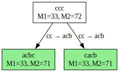

# Lab 1 (Скороходов Иван ИУ9-51Б)
Исходная SRS (24 вариант):
1) $\texttt{aa} \to \texttt{E}$ 
2) $\texttt{bb} \to \texttt{cccc}$ 
3) $\texttt{cc} \to \texttt{acb}$  
4) $\texttt{abc} \to \texttt{aabbcc}$ 
5) $\texttt{baabaac} \to \texttt{cbba}$ 
## Завершимость (есть)
Система завершима, рассмотри кортеж $<m1, m2, Lex>$, где 
- $m_1 := -(b(s) + c(s))$
- $m_2 := a(s) - 2b(s)$
- $Lex$ - лексикографический порядок ($a < b < c$)
  
где $a(s)$, $b(s)$, $c(s)$ — количество соответствующих букв в строке.

- $m1$ уменьшается в 2 и 4 правилах, в остальных не изменяется
- $m2$ уменьшается в 1, 3 и 5  правилах.

#### Идея: рассматривать уменьшение $m1$, если $m1$ не изменилось, то тогда уменьшилось $m2$ (зачем нужен $Lex$ поясняется в конфлюэнтности).

Теперь осталось подобрать $C1$ и $C2$ для обоих правил, чтобы они не уходили в отрицательные значения.

Проведем оценку (порождаем самую длинную непереписываемую цепочку):
- Не умаляя общности рассмотрим в троке букву $X$ (a или b или c)
- За переписывание $\texttt{X} \to \texttt{bb}$ (x2 от длины)
- Далее $\texttt{bb} \to \texttt{cccc}$ (x2 от длины)
- И наконец $\texttt{ссcc} \to \texttt{acbacb}$ (возьмем х3 от длины, чтобы был запас, все равно округляем вверх)
- А дальше конкатенация нескольких $acbacb$ уже никуда не переписывается 

По итогу:
- $C1 = len(s) * 12$ и $m_1 := len(s) * 12 -(b(s) + c(s))$
- $C2 = len(s) * 24$ и $m_2 := len(s) * 24 + a(s) - 2b(s)$ (так как в $m2$ рассматриваем $2b$, то наш вес увеличим ещё в 2 раза)

где $len(s)$ - длина изначальной строки до переписываний

## Классы эквивалентности (бесконечное количество)
В данной SRS бесконечное число классов эквивалентности.

Рассмотрим строки $(ab)^n$ ($n\ge1$) - каждая из них является НФ.

## Локальная конфлюэнтность (отсутствует)

И для устранения этой критической пары нам как раз понадобится $Lex$ (M1 и M2 на графе - наши меры).

## Пополняемость по Кнуту-Бендиксу (не пополняется)
- Из прошлого пункта добавляем правило $\texttt{cacb} \to \texttt{cacb}$
- Следующая пара: $\texttt{abacb} \to \texttt{acbacbacbc}$ (строка $abcc$, здесь и далее не буду приводить диаграммы, т.к. они очень большие)
- На пополнении $\texttt{bc} \to \texttt{cbacbacb}$ (строка $aabc$) возникает проблема с циклом
($\texttt{сbc} \to \texttt{ccbacbacb} \to \texttt{acbbacbacb} \to \texttt{acccccacbacb} \to \texttt{acacbccacbacb}$, т.е. $\texttt{cbc} \to \omega_1\texttt{cbc}\omega_2$).
#### A так как у нас изначально система завершимая, то $\texttt{bc} \to \texttt{cbacbacb}$ добавить нельзя и тогда система не пополняется
