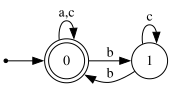
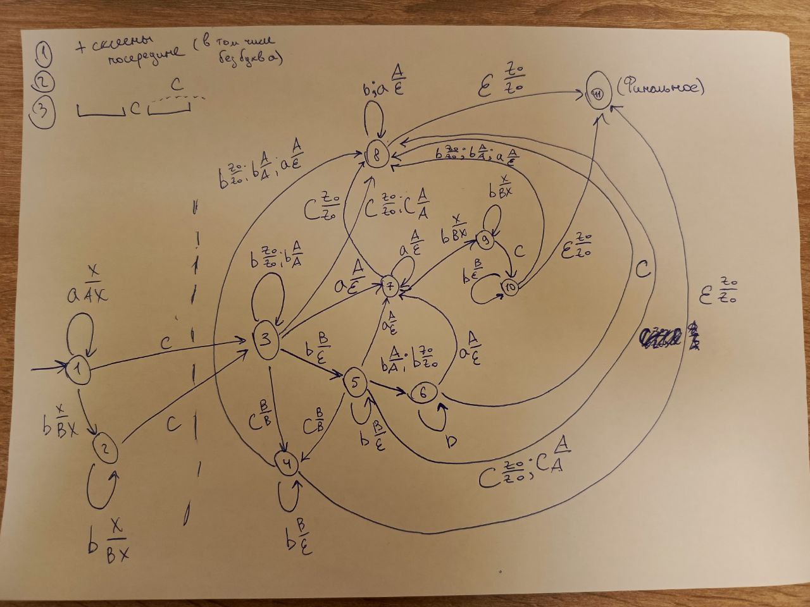
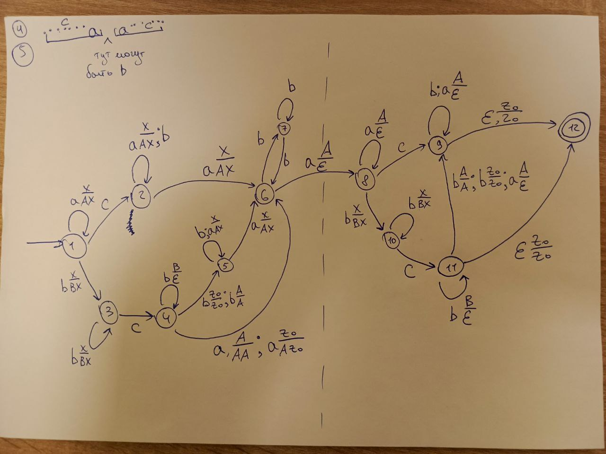
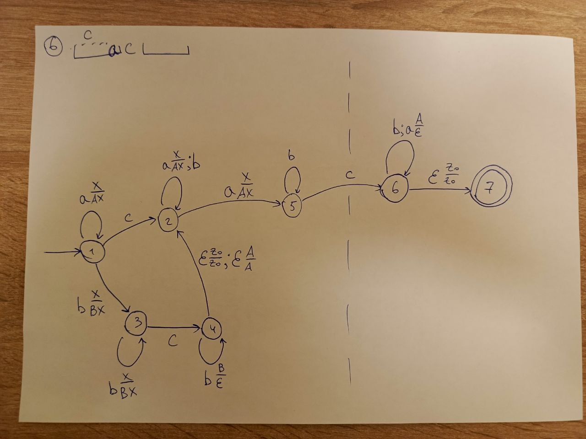
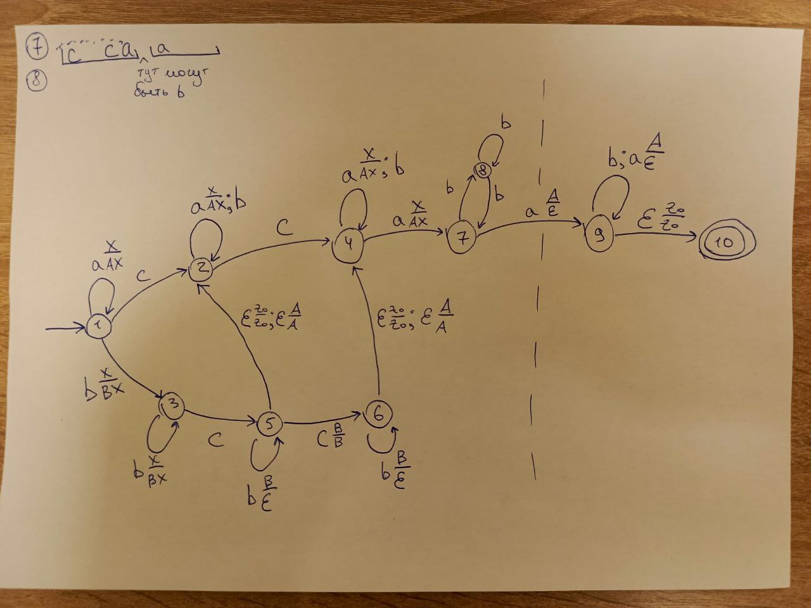

# RK2 (Скороходов Иван ИУ9-51Б, вариант 24)

### Здача 1

Язык SRS $ac \to ca, c \to bcb, bc \to cb$ над базисом $a^nca^nc$

Заметим, что:
- во всем слове у нас четное количество $a$
- количество $c$ ровно 2 шт и оно не изменяется
- в каждом блоке с $b$ у нас четное количество $b$
- разные блоки из $b$ (где в каждом четное количество) могут разделяться только блоками из $a$ (считаем, что $c$ внутри блока $b$ никак его не разбивает его на 2 отдельных блока)
- $c$ могут двигаться только влево, поэтому, применяя правила переписывания к изначальной строке, количество $a$ перед $c$ может только уменьшаться относительно базисной строки. Аналогично для $b$.

Данная таблица доказывает, что он не  регулярный. Тут шаблон, но если её продолжать по закономерности, то у нас бесконечное количество строк.
|        | $cac$ | $ca^3c$ | $ca^5c$ | $ca^7c$ | $ca^9c$ |
|--------|:---:|:----:|:----:|:----:|:----:|
| $a$     |  +  |  +   |  +   |  +   |  +   |
| $a^3$     |  −  |  +   |  +   |  +   |  +   |
| $a^5$     |  −  |  −   |  +   |  +   |  +   |
| $a^7$     |  −  |  −   |  −   |  +   |  +   |
| $a^9$     |  −  |  −   |  −   |  −   |  +   |

Итак, если мы будем знать нахождение середины слова относительно букв $a$, то наша задача сильно упрощается. До середины мы кладем $а$ на стек, потом снимаем со стека, на пустом стеке (+ нет символов на вход) завершаемся. Далее, в зависимости от того, в каких позициях (левой, правой половине или посередине, где середину считаем относительно букв $a$) находятся $c$, так же через стек можно определить, могли ли $b$ в конкретном слове быть сгенерированны согласно правилам. То есть мы разбиаем весь наш язык на непересекающиеся случаи, где $c$ располагаются в разных частях слова, построив для каждого случая PDA. А так как объединение КС языков является КС, то мы таким образом докажем КС-свойство исходного языка.

(Ремарка: каждый нижлежащий язык, описываемый PDA, мы пересечём с регулярным (чтобы упростить задачу по проверки четности $b$), который описывается следующим автоматом. КС, пересеченный с регулярным, - КС, а объединение КС - тоже КС.)


#### Первый PDA


Тут разбираются случаи:
- В слове вообще нет $a$ (во всех остальных случаях будет считаться, что как минимум одна $a$ присутствует в каждой половине слова)
- Первая (слева) $c$ находится ровно посередине слова, вторая $c$ находится в конце.
- Первая (слева) $c$ находится ровно посередине слова, вторая $c$ находится где-то в середине правой половины слова, они отделены хотя бы одной $a$.
- Обе $c$ находятся посередине.

(Ремарка: здесь и далее про блоки $b$ не говорится, но они учитываются в автоматах. По сути $b$ опаясывают $c$ или остаются левее их. Для простоты описывания случаев считается, что там где $c$, то слева и справа всегда могут быть $b$. А также пунктиром на каждом рисунке отмечен условный переход от левой части слова к правой.)

#### Воторой PDA


Тут разбираются случаи:
- Первая (слева) $c$ находится в первой половине слова, вторая $c$ находится в конце.
- Первая (слева) $c$ находится в первой половине слова, вторая $c$ находится где-то в правом блоке, но не посередине.

Так как у нас в каждом блоке как минимум одна $a$, то на стыке между половинами согласно случаям обязательно должны стоять $a$, но их могут разделять $b$, сгенерированные первой (слева) $c$, когда она была в середине до движения влево.

#### Третий PDA


Тут разбираются случаи:
- Первая (слева) $c$ находится в первой половине слова, вторая $c$ находится ровно посередине.

#### Четвертый PDA


Тут разбираются случаи:
- Первая (слева) $c$ находится в первой половине слова, вторая $c$ тоже находится в первой половине слова, при том они могут быть как спаянные ($cc$ или $cb^kc$), так и нет


Так как объединение КС, рассмотренных в вышеописанных PDA (+ пересечение этих КС с регулярным языком), является КС, то мы доказали, что наш язык является КС, но не регулярный (см. таблицу выше).
### Здача 2

Язык
```math
\left\{\, w_1\, aa\, w_2 \;\middle|\;
\begin{aligned}
& w_1 = w_3 b w_4 \;\land\; w_2 = w_5 w_6 \;\land & |w_3| = |w_4| \;\land\; |w_5|_c = |w_6|_c
\end{aligned}
\right\}, \quad \Sigma = \{a,b,c\}.
```

Пересечем его с $c^+bc^+aa(a|b|c)^*$ и рассмотрим


#### Накачка только x
- Если самая $b$ из $x$ попадает в область накачки, то при нулевой накачки $xz_2$ выходим из языка
- Если у нас $c^{k-i}bc^{k-j}aab(сас...)aa$ и мы берем за разделитель $|w_3|$ и $|w_4|$ первую по счету слева $b$, то у нас тогда возможны три варианта: левый блок $c$ длиннее, правый блок $c$ длиннее, или они равны. Если длиннее левый блок, тогда в силу $|w_3| = |w_4|$ в $|w_4|$ точно войдет как минимум одна $a$ из последующих $aa$ и следующая $aa$ (не входящая в $|w_1|$) будет только в конце из-за построения. Но тогда весь хвост до $aa$ должен принадлежать $|w_4|$, нарушается $|w_3| = |w_4|$, противоречие. Если длиннее правый блок, то при рассмотрении первой по счету слева $b$ как разделителя нарушается $|w_3| = |w_4|$, так как все что до $aa$ попадает в $|w_4|$, противоречие. Если они равны по длине, у нас возникает $|w_2|$ после первых слева $aa$ и нарушается $|w_5|_c = |w_6|_c$ (будем брать $k$ нечетным, чтобы в блоке $cac(ac)$  было нечетное количество $c$ в $|w_2|$).
- Если у нас $c^{k-i}bc^{k-j}aab(сас...)aa$ и мы берем за разделитель $|w_3|$ и $|w_4|$ вторую по счету слева $b$, то у нас также нарушается $|w_3| = |w_4|$, противоречие. 

#### Накачка в x длины не >k и в z_1, z_2
- В слове $xz_2$ применим нулевю накачку. Тогдау нас не будет $aa$ в слове, противоречие.

Следовательно, это не DCFL.

### Здача 3


Заметим, что у нас по сути слова языка будут состоять из блоков $b(b|a)^nb^n$ и вес блока составялет количество $b$ в нём.

Рассмотрим $ba^{n+1}b^{n+1}ba^nb^n$ (пересечем наш язык с $ba^+b^+ba^+b^+b$) и применим лемму о накачке ($xuvwy$ - шаблон, $|uw| >= 1$, $|uvw| < n$).

Заметим, что для справа могут стоять только $b$, компенсируя и $b$ (которые находились до этого), и $a$. 

- Самую первую слева $b$ трогать нельзя,так как тогда слово не будет принадлежать языку при нулевой накачке.
- Пусть $uvw$ попадают только в $a^{n+1}$. Тогда при положительной накачке в силу равного количества $b$ справа ($b(b|a)^nb^n$), то у нас для компенсации всех $a$ и присоединонного хвоста, так как первого слева блока из $b$ не хватит для компенсации и он "присоединится как хвост к левой части разбора нетерминала", останется только самый последний слева блок $b^n$, которого не хватит, так как $n < n + 1$.
- Аналогично с предыдущим пунктом если $uvw$ попадет в $b^{n+1}$ (нулевая накачка), $b^{n+1}b$ (нулевая накачка), $ba^n$ (положительная накачка), $a^n$ (положительная накачка).
- При нулевой накачке $b^n$ этого блока не хватит для компенсации предыдущего блока $a^n$.
- Пусть $uvw$ попадают на стык в $a^{n+1}b^{n+1}$. Тогда при нулевой накачке нарушается $S_2.attr < S_1.attr$, так как количество $b$ в $S_1$ уменьшится.
- Пусть $uvw$ попадают на стык в $a^nb^n$. Тогда при положительной накачке тоже нарушается $S_2.attr < S_1.attr$, так как количество $b$ в $S_2$ увеличится.
- Пусть $uvw$ попадают на стык в $b^{n+1}ba^n$, при том $u$ в $b^{n+1}$, а $w$ в $a^n$. Тогда при положительной накачке последнего слева блока $b^n$ не хватит для компенсации $a$ до него.

Следовательно, это не КС.
