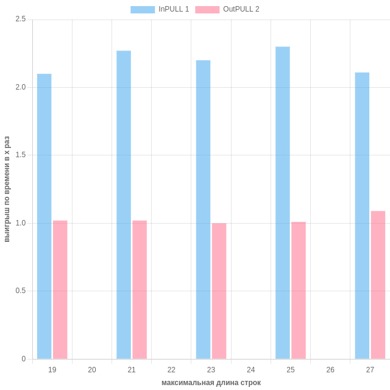

# Lab 4 (Скороходов Иван ИУ9-51Б, вариант 24)

Исходное расширенное регулярное выражение: `^(((?:\2a\2b)|a)*)bab\1$`

Проанализируем структуру слов, которые могут получаться из него.

### Первая группа захвата (\1)

Язык является палиндромом относительно центрального якоря $bab$ благодаря первой группе захвата, имея структуру $XbabX$

### Вторая группа захвата (\2)

Так как семантика нестандартная, то в самом начале выбирается альтернатива ($a$).
Потом всегда два варианта:
1. выбрать `a` и сбросить цепочку (о ней дальше)
2. продолжить цепочку через выбор `\2a\2b`

При выборе второго варианта, имея в `\2` строку $w$, мы получим $wawb$ как следующее звено в цепочке.
Теперь поймем, какие цепочки у нас могут возникать. Рассмотрим последовательность ($a$ и $b$, которые добавляются как конструктор для нового звена, для удобства будем на каждом шаге обозначать большими буквами)
| № | Строка                              | Обозначение |
|---|-------------------------------------|-------------|
| 1 | $a$                                 | $y_1$          |
| 2 | $aAaB$                              | $y_2$          |
| 3 | $aaabAaaabB$                        | $y_3$          |
| 4 | $aaabaaaabbAaaabaaaabbB$            | $y_4$          |
| 5 | $aaabaaaabbaaaabaaaabbbAaaabaaaabbaaaabaaaabbbB$ | $y_5$ |
| 6 | …                                   | …           |

Таким образом $X$ (из $XbabX$) состоит из последовательно расположенных непересекающихся цепей, где каждая цепь может включать как только звено $y_1$, так и строго последовательно неисключаемые звенья от $y_1$ до $y_k$.

### Докажем, что язык с такими словами не является КС.

Для начала заметим, что получить подряд идущие $b$ можно получить только в звеньях цепи, а также $bab$ встречается только один раз и располагается посередине.

Рассмотрим строку $aw_1b^nbabaw_2b^n$ ($w_1 = w_2$). При том $aw_1b^n$ и $aw_2b^n$ составляют одну единую цепь (от $y_1$ до $y_{n+1}$, так как $y_{n+1}$ заканчивается на $b^n$). Применим лемму о накачке ($xuvwy$ - шаблон, $|uw| >= 1$, $|uvw| < n$). По построению звеньев цепи видно, что если у нас в конце оказывается $b^n$, то $|w_1| = |w_2| > n$.

- Пусть $uvw$ попадает в любую часть $aw_1b^n$ (левый $X$ в $XbabX$). Тогда из-за равенства левой и правой частей ($XbabX$) получаем противоречие.
- Первая $b$ слева (в подстроке $bab$) может попасть в область накачки, но тогда при нулевой накачке перераспределяются буквы $b$ из левой подстроки ($aw_1b^n$) и слово выходит из языка (из-за равенства левой и правой частей $XbabX$), противоречие.
- Аналогично возникает противоречие с правой $b$ (в подстроке $bab$) при нулевой накачке, так как $X$ в $XbabX$ может начинаться только с $a$ с нашей длинной.
- При положительной накачке $a$ (в подстроке $bab$) мы также выходим из языка, $bab$ в слове пропадает. 
- Вообще из-за того, что $bab$ только встречается четко посередине ровно один раз в слове (её нельзя сгенерировать), то эту подстроку никак нельзя трогать, чтобы не выйти из языка.
- Пусть $uvw$ попадает в любую часть $aw_2b^n$ (правый $X$ в $XbabX$). Тогда из-за равенства левой и правой частей ($XbabX$) получаем противоречие.
- Пусть $uvw$ попадают на стык в $b^nbabaw_2$, при том $u$ в $b^n$, а $w$ в $aw_2$. Тогда при любой накачке нарушается равенство левой и правой частей.

Таким образом этот язык не КС.

### Оптимиризоваррный парсер.

Идейно:
- Находим середину строки и сразу проверяем наличие в ней $bab$
- Проверяем равенство левой и правой частей ($XbabX$)
- В следствие того, что у нас последовательно идут цепочки, а последнее звено цепочки однозначно характеризуется количеством подряд идущих $b$, которые располагаются всегда в конце хвоста цепочки, то, идя справа налево, мы либо встречаем цепь, состоящую только из звена $y_1$, либо цепь, оканчивающуюся на $y_k$. В обоих случаях мы однозначно восстанавливаем цепь, сравнивая её с подстрокой, и переходим затем к разбору следующей цепочки.

По сути при таком полходе мы попадаем в O(n).

### Сравнение производительности парсеров.

Перед графиком и разъяснением методики сравнения небольшая ремарочка: "наивный парсер" также находит середину, проверяет ее на равенство "bab", а также проверяет равенство левыой и правой частей ($XbabX$), ибо грех этим не воспользоваться. Однако идёт слева направо и рекурсивно перебирает подходящие шаблоны (цепочки).

Что касается сравнения производительности, то сравнивалось всё время, затраченное парсерами на каждый пулл. Делилось время обычного парсера на время оптимизированного. Также брались все возможные строки длинн от 13 до n, где n и будет изменяться. Синим цветом на графике отмечен выигрыш во времени, когда строки принадлежали языку. Красным - когда не принадлежали. График строился исходя из тестера, который приложен к лабораторной работе.

Из графика видно, что оптимизированный парсер дает значительный прирост во времени, когда строка принадлежит языку, и сравним с "наивным" в противном случае.
